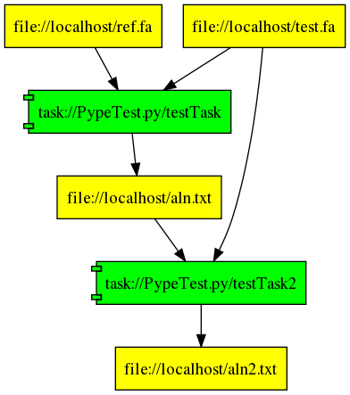
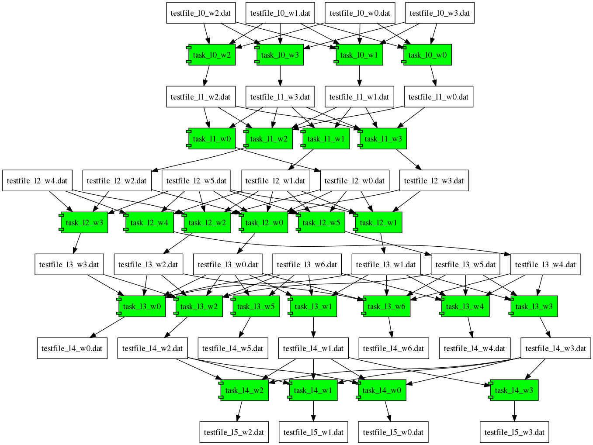

==================
Usage and Examples
==================

pypeFLOW Objects
================

There are three different kinds of pypeFLOW objects:
    
    1. Data Object
    2. Task Object
    3. Workflow Object

Data Object
============

The data objects represent the input and output data that is
processed by a pypeFLOW task objects.

Currently, only local file objects are implemented. In the
future, more general data (e.g. a remote file or Amazon S3
object) can be supported.

Here is how to create an instance of a local file data object::

    f1 = makePypeLocalFile("filename")

The ``makePypeLocalFile`` returns a ``PypeLocalFile``
object. It does not create the file in the file system.

Task Object
============

A test object is generally created by the ``@PypeTask`` or
``@PypeShellTask`` decorator with a task function. You will
need to specifiy the input files and the output files with
``@Task`` decorator.  The task function should declared with
the variable argugment lists ``*argv, **kwargv`` as
argumnets::

    @PypeTask(inputDataObjs={"fasta":f1, "ref":f2},
              outputDataObjs={"aln":f3})
    def testTask(*argv, **kwargv):
        print("testTask is running")
        print("fasta input filename is %s" %  testTask.fasta.localFileName)
        # do something to create the output file(s)

The decorator return a callable object with the same name of
the function. The above example returns an instance of
``PypeTaskBase`` object. Within a task function, the input
and output data objects can be retrieved as an instance
attribute. For example, within the ``testTask`` function,
``testTask.fasta`` is the ``f1`` data object.
``testTaske.fasta.localFileName`` will give the local file
of the file data object.

Workflow Object
===============

The workflow object contains task objects and data objects.
It creates the dependency directed acyclic graph (DAG)
according to input and output data objects specified for
each task.  Circular dependency will be detected. Output
data files should be only dependent on one single task. It
is generally not a good idea to write to the same "output
file" from two tasks.

The general pattern to specify a workflow is

    1. Initialize a workflow object

    2. Add data objects and task objects. One can only add
       task objects, the data objects that a task object is
       dependent on will be added into the workflow
       automatically.

    3. Specify the data objects to be "refreshed". Namely,
       the workflow controller will evaluate the DAG and try to
       update the specified data objects if necessary. If a
       workflow has been executed and the initial and
       intermediate data objects do not change, then no task
       will be executed.  The tasks will be only executed when
       the dependency is not satisfied. Currently, we use the
       data objects' time stamp to determine the dependency. If
       the output files are newer than the input files for a
       task, the task will be ignored.

See the following section for an example.

Simple Example
================

A simple workflow can look like this::

    from pypeflow.common import * 
    from pypeflow.task import PypeThreadTaskBase, PypeTaskBase
    from pypeflow.task import PypeTask, PypeShellTask, PypeSGETask, PypeDistributibleTask
    from pypeflow.controller import PypeWorkflow, PypeThreadWorkflow
    from pypeflow.data import PypeLocalFile, makePypeLocalFile

    def simpleTest():

        wf = PypeWorkflow() 
        
        # f1 and f2 are the mock input files
        f1 = makePypeLocalFile("test.fa")
        f2 = makePypeLocalFile("ref.fa")
        
        # f3 is the object of the expected output of the "testTask"
        f3 = makePypeLocalFile("aln.txt", readOnly=False)

        # create the mock files
        os.system("touch %s" % f1.localFileName)
        os.system("touch %s" % f2.localFileName)
       
        # the testTask will take f1 (as "testTask.fasta") and f2 (as "testTask.ref") and generate f3 (as "testTask.aln")
        @PypeTask(inputDataObjs={"fasta":f1, "ref":f2},
                  outputDataObjs={"aln":f3},
                  parameters={"a":10}, **{"b":12})
        def testTask(*argv, **kwargv):
            print("testTask is running")
            for ft, f in testTask.outputDataObjs.iteritems():
                #os.system("touch %s" % f.localFileName)
                runShellCmd(["touch", "%s" % f.localFileName])
                runShellCmd(["sleep", "5" ])

        # the testTask will take f1 (as "testTask.fasta") and f3 (as "testTask.aln") and generate f4 (as "testTask.aln2")
        f4 = makePypeLocalFile("aln2.txt", readOnly=False)
        @PypeTask(inputDataObjs={"fasta":f1, "aln":f3},
                  outputDataObjs={"aln2":f4},
                  parameters={"a":10}, **{"b":12})
        def testTask2(*argv, **kwargv):
            print("testTask2 is running")
            for ft, f in testTask2.outputDataObjs.iteritems():
                #os.system("touch %s" % f.localFileName)
                runShellCmd(["touch", "%s" % f.localFileName])
        
        # one can add objects one by one to the workflow
        #wf.addObjects([f1,f2,f3,f4]) 
        #wf.addObjects([testTask, testTask2])
       
        # or, one can add the "tasks" into the workflow, the input and output data objects will be added automatically
        wf.addTasks([testTask, testTask2])

        #print out the RDFXML file that represents the workflow
        print (wf.RDFXML)
        #a graphviz dot for rendering the dependency graph if one
        print (wf.graphvizDot)

        # execute the workflow until f4 is updated
        wf.refreshTargets([f4])

        # mock the case that f1 is updated
        print("re-touch f1")
        os.system("sleep 1;touch %s;" % f1.localFileName)
        wf.refreshTargets([f4])

        # mock the case that f3 is updated
        print("re-touch f3")
        os.system("sleep 1;touch %s;" % f3.localFileName)

The dependecy graph is shown below:

In the ``example/`` directory, you can generate a more complicated mock example and excute it
by running the ``PypeTest.py`` script with ``python PypeTest.py localshell 1``.

The dependency graph of the mock workflow looks like:

