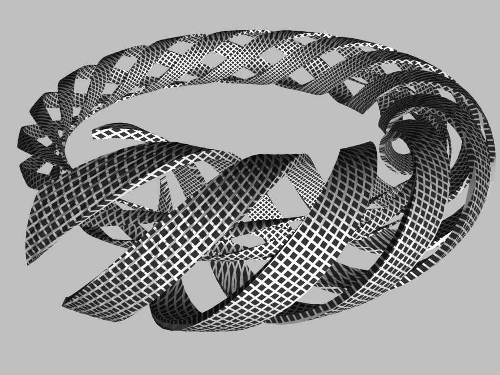
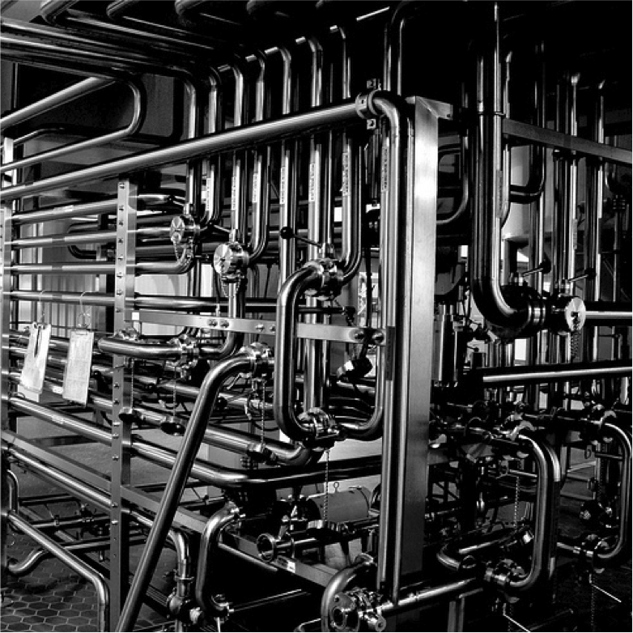

pypeFLOW Tutorial
=================

-----------------

What is pypeFLOW?
-----------------

What is pypeFLOW?  A toolkit to contruct data processing work flow

Tracking data processing within the Python language

-----------------

Basic Objects
-------------

data objects (defined in ``pypeflow.data.*``)

task objects (defined in ``pypeflow.task.*``)

workflow objects (defined in ``pypeflow.controller.*``)

Analogous to Makefile

.. code-block:: python
    
    @PypeTask( inputs = {'dep1':dep1, 'dep2':dep2},
               outputs = {'target':target} )
    def do_something_to_get_the_target(self, *argv, **kwargv):
        ...

is equivalent to

.. code-block:: make

    target: dep1 dep2
        do_something_to_get_the_target ...

* Every PypeObjects is initialized by an URL and uniquely identifiable by it. 

---------------------

Data Objects
------------

``PypeLocalFile`` is an object representing a reference to local file

.. code-block:: python

    f = PypeLocalFile("file://localhost/home/jchin/test/test.txt")

``f`` is a local file at ``/home/jchin/test/test.txt``

.. code-block:: python

    assert f.URL == "file://localhost/home/jchin/test/test.txt"
    assert f.localFileName == "/home/jchin/test/test.txt"

------------------------

Basic Task Objects
------------------

`PypeTaskBase`` is the base class representing a `task` that converts some 
input files to some output files. 

Such `task` is typically constructed by using a decorator (e.g. ``PypeTask``)
to wrap a function into a ``PypeTaskBase`` objects (or objects of the 
subclasses of ``PypeTaskBase``)

One needs to specify the input and output data objects within the decorator.
The data objects can be referred within the task function that gets wrapped.

Example:

.. code-block:: python
    
    in_file1 = PypeLocalFile("file://localhost/home/jchin/test/test.txt")

    @PypeTask( inputs = {"in_file1": in_file1, "in_file2": in_file2},
               outputs = {"out_file2": out_file2, "out_file2": out_file2} )
    def task(self, *argv, **kwargv):
        assert self.in_file1.localFileName == "/home/jchin/test/test.txt"
        #do somethings to generate out_file1 and out_file2
        
    assert task.in_file1 == in_file1

------------------------

Task Decorator is Actually a Function
-------------------------------------

If you don't like Python's decorator, you can generate tasks by calling the
decorator function directly. This is useful to generate a number of tasks 
programmatically, e.g., using a loop to generate a number of tasks. 

.. code-block:: python

    tasks = []
    def task_func(self, *argv, **kwargv):
        # do something
        pass

    for i in range(10):
        # task_decorator is a function that takes a function as an input argument
        # and it returns a PypeTaskBase object 
        task_decorator = PypeTask(inputs={"f":inputObjs[i]},
                                  outputs={"g":outputObjs[i]},
                                  URL="task://localhost/task%s" % i) 
        t = task_decorator(task_func)
        tasks.append(t)

-----------------------

Different Kind of Task Objects 
------------------------------

Different ``*Task`` decorators can wrap different kind of function (or
objects, e.g shell script strings)

    - ``PypeTask``, wrap Python function, run as a Python function

    - ``PypeShellTask``, wrap a string as shell script, run as a Python function
      that executes the shell script

    - other decorators for different purposes can be written as needed (e.g. 
      ``PypeSGETask``)

One can use ``TaskType`` keyword argument in the decorator to control the
output task types

    - Simple task type: ``PypeTaskBase``

    - Task type that can be run concurrently within different threads: ``PypeThreadTaskBase``

    
-----------------------

Some Examples About Tasks I
---------------------------

.. code-block:: python

    @PypeTask( ..., TaskType = PypeTaskBase)
    def simple_py_func(self, *argv, **kwargv):
        ...

    @PypeTask( ..., TaskType = PypeThreadTaskBase)
    def simple_py_func(self, *argv, **kwargv):
        ...

    t = PypeShellTask( ..., TaskType = PypeTaskBase)("#!/bin/bash; echo I am a task")

    t = PypeShellTask( ..., TaskType = PypeThreadTaskBase)("#!/bin/bash; echo I am a task")

-----------------------

Some Examples About Tasks II
----------------------------

An instance of the ``PythonTaskBase`` class is a "callable" object, namely, 
it implements ``__call__`` method.  When it gets called, it will check the 
dependency of the input and output objects and make a decision whether to 
execute the wrapped function.

.. code-block:: python

    task_decorator = PypeTask(inputs={"f":f},
                              outputs={"g":g}) 
    def task_func(self, *argv, **kwargv):
        do_something()

    # calling task_func() will return True and the original task_func is executed
    # if f is newer than g

    # assuming g does not exist
    task_func() # return True, do_something() is excuted, assuming g is generated
    # run it again
    task_func() # return False, the original task_func is not called, since g is newer than f

    
-----------------------

Workflow Objects 
----------------

A ``PypeWorkflow`` object contains a collection of ``PypeDataObjects`` and
``PypeTaskBase`` objects. It calculates the dependency graph and executes all
tasks with the correct order.

* ``PypeWorkflow``: vanilla workflow class, one task at a time
* ``PypeThreadWorkflow``: workflow class that can run tasks concurrently using 
  Python thread library
* ``PypeMPWorkflow``: workflow class that can run tasks concurrently using Python
  multiprocessing library

-----------------------

Workflow Building Pattern  
-------------------------

Set up a workflow object 

.. code-block:: python

    wf = PypeWorkflow(...)
    wf = PypeMPWorkflow(...)

Set up a task

    - Set up data objects
    - Define a ``task_func`` to be wrapped
    - Use ``PypeTask`` decorator to create the real ``PypeTaskBase`` object

Add the task into the workflow (The inputs and outputs will be added automatically)

Set up more tasks and add them into the workflow (``wf.addTasks([t1,t2,...])``)

Call ``wf.refreshTargets(target_list)`` to execute the tasks (only task that does not
satisfy the dependency constrain will be execute)

-----------------------

Put It All Together
-------------------

`Code Demo <http://localhost/place_holder>`_.

`Embarrassing Parallelization Workflow <https://localhost/plact_holder>`_. 

------------------------

Mutable Data Objects & State Objects
------------------------------------

Issue:

  * Side effect: If a data object (e.g. various gff, cmp.h5 files) is 
    both input and output, we can not use it to calculate dependency. 
  * Such file usually has some "internal states" that affect
    how tasks should be executed

Solution

  * Be explicit.
  * introduce "mutableDataObjs" for a task indicating those data objects that a 
    task can modified.  If an object is used as "mutableDataObjs", it is not used
    for calculating the task dependency.
  * The standard "inputs" and "outputs" should be "immutable" objects within the
    scope of the workflow.
  * Special state objects to keep track the states. The state objects are used as
    the input objects and/or output objects to control the task dependency (see 
    `Example <http://localhost/place_holder>`_)

-------------------------

Output Collision Detection
--------------------------

The dependency graph as a direct acyclic graph helps to find 
independent tasks that can be run concurrently

However, in the case that multiple tasks write to the same
output file, we need to detect "output collision" and do not
allow tasks that writes to the same to be run concurrently.

Code snippet finding tasks that can be submitted

.. code-block:: python

    jobsReadyToBeSubmitted = []

    for URL, taskObj, tStatus in sortedTaskList:
        prereqJobURLs = prereqJobURLMap[URL]
        outputCollision = False

        for dataObj in taskObj.outputDataObjs.values() + taskObj.mutableDataObjs.values():
            for fromTaskObjURL, activeDataObjURL in activeDataObjs:
                if dataObj.URL == activeDataObjURL and taskObj.URL != fromTaskObjURL:
                    logger.debug( "output collision detected for data object:"+str(dataObj))
                    outputCollision = True
                    break
        
        if outputCollision: #the task can not be executed
            continue
    ...

-------------------------

Scatter-Gather Pattern
----------------------

Pattern:

    - Start with a file  
   
    - Split it into a number of small files of the same type 
   
    - process them as processing the original file 
   
    - generate some partial results 
    
    - put partial results back into a single file 

Complexity
   
    - Multiple input files / output files 

    - Chaining of scattered tasks

------------------------------------

Encapsulating Scattered Files 
-----------------------------

``PypeSplittableLocalFile``: Represent a PypeData object that has two
different local file representations:

   - the whole file (could be a virtual one)
   - the split files

Such data object can have either a scatter task attached or a gather task
attached.

   - If a scatter task is attached, the task will be inserted to generate the
     scattered files.

   - If a gather task is attached, the task will be inserted to generate the
     whole file.

   - If neither scatter task nor gather task is specified, then the file is
     mostly like intermediate data.  Namely, the whole file representation is
     not used any place else.

   - One can not specify scatter task and gather task for the same object since it
     will create a loop.

------------------------------------

Generate Scattered Tasks
------------------------
    
Special decorator to generate a set of "scattered tasks":
    
    - Explicitly generating a collection of tasks that work on the split files

    - Special task decorators to generate the collection:

     ``PypeScatteredTasks``: a decorator that takes a function as an input and generate
     a collection of tasks that does the real work (alias as ``getPypeScatteredTasks``
     to be used as a regular function)
    
     ``PypeScatteredTasks/getPypeScatteredTasks`` returns a ``PypeTaskCollection`` object
     which contains all the sub-tasks / scatter tasks / gather tasks.

When a ``PypeTaskCollection`` object is added into a workflow, the real sub-tasks are 
added automatically.

`Example / Demo <http://localhost/place_holder>`_

-------------------------

FOFN Mapper
-----------

A special decorator/function that takes a FOFN (file of file names) as the main
input and generate the tasks with the inputs are the files specified in
the FOFN. ( This is different from a "scatter" task which keeps the file 
type the same. ) 

.. code-block:: python

    def outTemplate(fn):
        return fn + ".out"

    def task(self, *argv, **kwargv):
        in_f = self.in_f
        out_f = self.out_f
        #do something with in_f, and write something to out_f

    tasks = getPypeFOFNMapTasks(FOFNFileName = "./file.fofn", 
            outTemplateFunc = outTemplate, 
            TaskType = PypeThreadTaskBase,
            parameters = dict(nSlots = 8))( alignTask )

    for t in tasks:# You can run the tasks in sequential 
        t()

    wf = PypeThreadWorkflow() # or run them in parallel using thread or multiprocessing
    wf.CONCURRENT_THREAD_ALLOWED = nproc 
    wf.MAX_NUMBER_TASK_SLOT = nproc
    wf.addTasks(tasks)
    wf.refreshTargets(exitOnFailure=False)

---------------------------------

Query Workflow Objects
----------------------

Workflows has a canonical RDF representation. One can query the DAG using SPARQ

For example, give a workflow DAG, what are the workflow inputs and outputs

.. code-block:: python

    @property
    def inputDataObjects(self):
        graph = self._RDFGraph
        inputObjs = []
        for obj in self.dataObjects:
            r = graph.query('SELECT ?o WHERE {<%s> pype:prereq ?o .  }' % obj.URL, 
                                                           initNs=dict(pype=pypeNS))
            if len(r) == 0:
                inputObjs.append(obj)
        return inputObjs

    workflow.inputDataObjects # <- the input data objects of the whole workflow

----------------------------

Update Workflow Objects
-----------------------

We can redirect the inputs and outputs to different underlying files using
``workflow.updateURL()``

.. code-block:: python

    def updateURL(self, oldURL, newURL):
        obj = self._pypeObjects[oldURL]
        obj._updateURL(newURL)
        self._pypeObjects[newURL] = obj
        del self._pypeObjects[oldURL]

It is possible to build a workflow structure and set up the real inputs
and outputs later. This is useful to setup the workflow input/output from
command line options and/or an XML configuration file.

.. code-block:: python

    for o in workflow.inputDataObjects: 
        if o.URL == "files://virtual/xyz":
            realInputFile = os.path.abspath(sys.argv[1])
            o.updateURL("files://localhost%s" % realInputFile)
    ...

-------------------------

Debugging Support
-----------------

graphviz dot output

logging

test coverage about 70%, 22 tests now

The whole thing is about 2000 LOC (without counting
testing code.)::

    $wc src/pypeflow/*.py

      0       0       0 src/pypeflow/__init__.py
    148     539    4428 src/pypeflow/common.py
    744    2603   28166 src/pypeflow/controller.py
    313    1140   11096 src/pypeflow/data.py
    814    2645   28005 src/pypeflow/task.py
   2019    6927   71695 total

----------------------------

What's Next?
------------

* I will use this PypeFLOW for producing better reproducible 
  bioinformatics analysis developed with in Python/IPython notebook

* Some new features:

  - Supporting data object in memory? mmap file? numpy array?
  - Remote data objects
  - HDF5 data sets as native data objects
  - direct python function execution (through IPython parallel or Pyro like RPC call)

* Similar framework for streaming data processing rather than batch data
  processing

